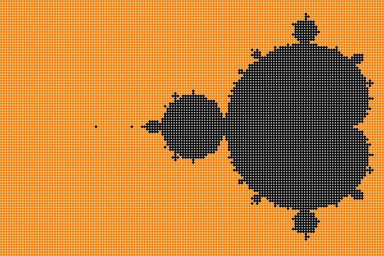

# Quick Mandle Brot

Try to quickly implement mandlebrot as an exercise in golang.

Generate the image below by running:
```bash
go build -o quick_mandlebrot.out
./quick_mandlebrot.out
```

## Output
